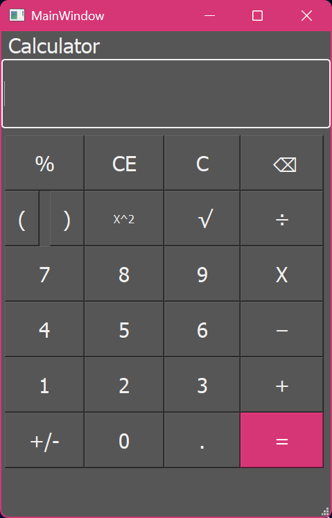
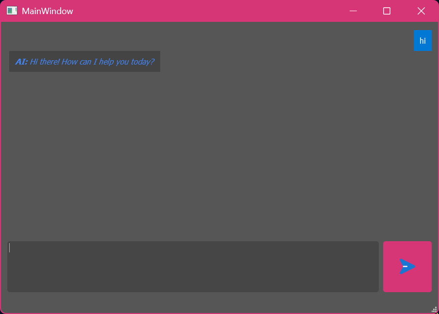

#📝 just simple notpad with Gemini ai and calculator
its a notepad made with Python and PyQt5. You can create paseges type notes evrithing is saved in datbase. It autosaves, so when you close it and open it will save the page you were on and the notes that you where taiking
## ✨ Features

* **AI Chat Integration**: Chat with Gemini 2.5 Flash directly inside the app. 
* **Notepad**: Automatically saves notes to a SQLite database. Includes font scaling (+/-) and autosave
* **Calculator**:basic Calculator with  a secondary window that pulls your Windows Accent Color dynamically for a native OS feel.
* **Modern UI**: Dark mode interface with a custom "Gemini Glow" animated gradient button.

## 🚀 Installation
1. Clone the repository

2.Set up a virtual environment:
python -m venv .venv
source .venv/Scripts/activate  # On Windows

3.Install dependencies:
pip install PyQt5 google-genai python-dotenv

4. Create a .env file in the root directory and add your Google API Key:
GOOGLE_API_KEY=your_actual_key_here

5. And run this app from: python main/notepad.py

## 🖼️UI screenshots

## Notepad

## Calculator

## Ai chat

